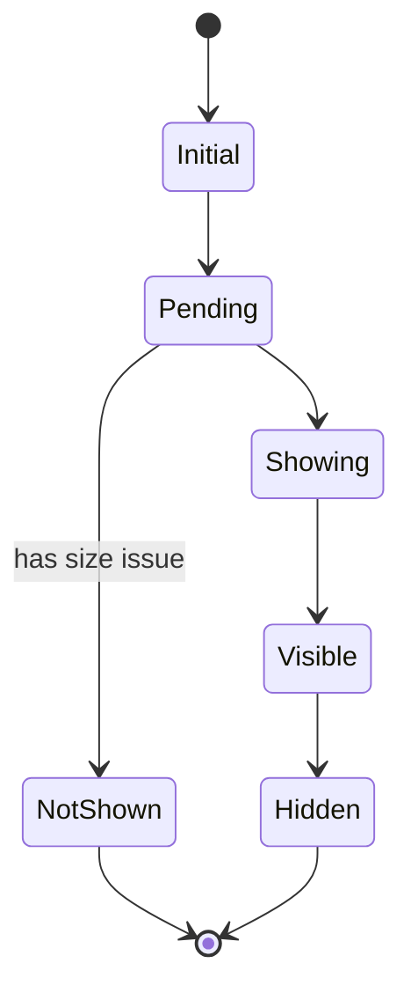

# Banner Conductor

The Banner Conductor is the root Vue component and is responsible for handling the top level banner states, and is the gateway for interactions between the banners and the pages they are displayed on. It is largely invisible to the developers.

Internally it uses a [Finite State Machine](https://en.wikipedia.org/wiki/Finite-state_machine) (FSM) with the following state flow: 

The states are as follows:

* **Initial** This state does nothing, it is used as a default state when the FSM is instantiated.
* **Pending** This pre-sets the banner height on the Page and starts the banner display timer.
* **NotShown** When there is a size issue, or if the user interacts with certain elements on the page while the banner display timer is running the FSM will move to this state at the timer end. It will then mark the banner as not shown and fire tracking events.
* **Showing** This is the banner transition phase. It is in this state when the banner is animating into the page.
* **Visible** The banner is now finished transition and is visible to the user on the page. It will update the display counts and trigger the displayed tracking events when entered. _Note: This does not control which part of the banner is visible, that is the responsibility of the banner components._
* **Hidden** When the user has closed the banner.