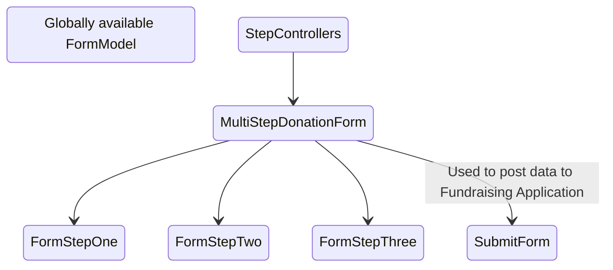
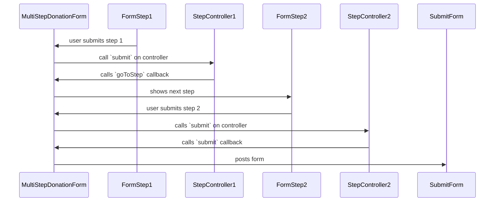

# Multi Step Donation Form and Form Controllers

Since the 2022 campaign, a lot of tests had multistep forms, each one with a different flow. These tests are different enough functionally that they would require a new `DonationForm` component for each.

In order to avoid duplicating components per-test we opted to instead create a flexible `MultiStepDonationForm` that gets each form step as a named slot. Each named slot also gets an implementation of a `StepController`, which contains the logic that determines which form page to show, based on the user interaction with the current form page.

This module consists of the following parts:

## `MultiStepDonationForm.vue`

This initializes and presents the form:
1. It connects the individual form pages to the `StepController` instances to handle the flow of the submissions.
2. It wraps the `FormStep` components in its slots in a `Slider` component and starts the slides at the first slide.
3. From then on it acts as a bus between the `StepController` instances, `Slider` and the `FormSteps`.

## `FormModel`

This is a [Vuejs composable](https://vuejs.org/guide/reusability/composables.html) and contains the form state. It is globally available. This contains only the data that will be posted to the Fundraising Application and should not be modified for a single test.

## `FormSteps`

A banner form consists of one or more step components (components containing with form elements). Each step:

* Is in the directory `src/components/DonationForm/Forms`
* Handles its own validation.
* Emits a `submit` or `previous` event with data. The `MultiStepDonationForm` passes the events to the `StepController` and allows it to decide what to do next.
* Optionally resets state when they are entered or exited. For example if a user hits the back button we reset some forms to their default state, and we expect the user to fill them out again to proceed. The form can watch its `isCurrent` property to detect when it becomes the current step.
* Optionally modify the `FormModel` directly. The `FormModel` contains only data that will be posted to the Fundraising Application. Some form steps, like the `MainDonationForm` have fields that directly correspond to `FormModel` properties and will change it directly. Other forms, however, are for modifying this data as a side effect of the `submit` and `previous` actions. These forms pass the extra data to their `StepController` and it will decide what should change in the `FormModel`.

## `StepController`

There are multiple implementations of this interface, at least one per form step. It is responsible for handling the flow of the submission, instructing the `MultiStepDonationForm` either to submit or go to a different step.

Each controller instance has two methods, called by `MultiStepDonationForm`:
* `submit` This is called when a sub-form has been submitted. The data passed has already been validated. It may get extra data about the user input from the form step.
* `previous` This is called when the user clicks the back button.

The `MultiStepDonationForm` passes the following callbacks into each StepController:
* `goToStep` makes the `MultiStepDonationForm` go to a different page with the specified name. `MultiStepDonationForm` builds an internal mapping between the step names and the step index needed by its `Slider` component.
* `submit` makes the `MultiStepDonationForm` submit the current values of `FormModel` via the `SubmiForm` (see below).

Each `StepController` has a factory function that provides it with the slot names of the possible other steps it can go to.
The `StepController` factory functions follow the following naming schema:
`create<SubmitBehavior><StepName><OptionalSpecifier>`

* `<SubmitBehavior>` can either be `Intermediate` (meaning the step will not submit, but go to a different form step) or  `Submittable` (meaning the controller will call `submit` or *may* go to a different step in some cases).
* `<StepName>` is the name of the form component, e.g. `MainDonationForm` or `AddressTypeForm`.
* `<OptionalSpecifier>` is an optional description of the controller behavior, e.g, `SinglePage`

Example factory functions: `createSubmittableAddressType`, `createIntermediateUpgradeToYearly`, `createSubmittableMainDonationFormSinglePage`

## `SubmitForm`

This is a hidden form. It contains the values from the `FormModel` as hidden fields and is submitted by the `MultiStepDonationForm` when a `StepController` invokes the `submit` callback. This data is the POSTed to the Fundraising Application as a standard HTTP POST request. 

## In Summary

* The `MultistepDonationForm` acts like an event bus and keeps track which page is the current one.
* The `FormModel` contains the form state values.
* The `StepControllers` handle the form submission logic.
* The `FormSteps` handle their own validation and fire submit/previous events.
* Some `FormSteps` modify the model state directly or pass their data to the `StepController` for extra computing.
* The `SubmitForm` has hidden form fields with `FormModel` values and POSTs to the Fundraising Application. 

Below is an example happy path user flow.

## Notes for the future

This module isn't perfect. Depending on the direction of the future campaign tests we might improve some things about it.

* The form user flows are badly designed. For example, we don't know the reasoning why some forms clear their own state on back. This needs to be clarified before a redesign happens.
* `FormSteps` Some of these modify the `FormModel` directly, some pass extra data so the `StepController` can modify this data. These steps could be changed to each contain their own state and the `StepController` becomes responsible for changing all `FormModel` state, meaning the `FormModel` no longer needs to be so global.
