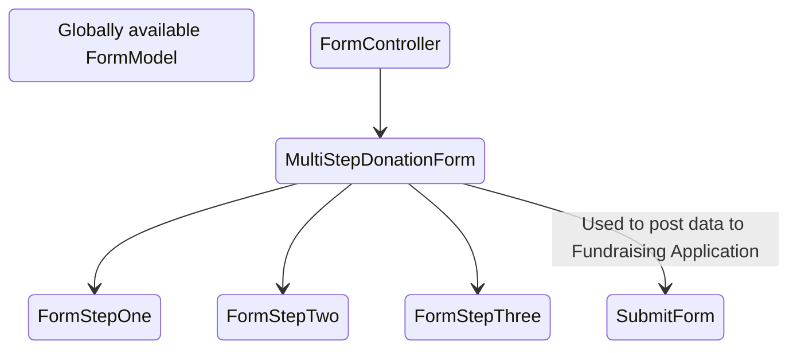
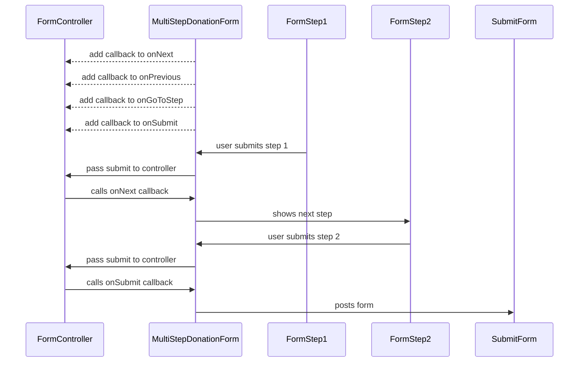

# Multi Step Donation Form and Form Controllers

Since the 2022 campaign a lot of tests have been focused on multistep forms, each with different flows. These tests are different enough functionally that they would require a new `DonationForm` component for each.

In order to avoid duplicating components per-test we opted to instead create a flexible `MultiStepDonationForm` that is provided with different implementations of a `FormController` which contains the logic that determines which form page to show, based on the user interaction with the current form page.

This module consists of the following parts:

## `MultiStepDonationForm.vue`

This initialises and presents the form:
1. It connects the individual form pages with the callbacks of the `FormController` to handle the flow of the submissions.
2. It wraps the form pages in a `Slider` component and starts the slides at page 1.
3. From then on it acts as a bus between the `FormController`, `Slider` and the `FormSteps`.

## `FormModel`

This is a [Vuejs composable](https://vuejs.org/guide/reusability/composables.html) and contains the form state. It is globally available. This contains only the data that will be posted to the Fundraising Application and should not be modified for a single test. 

## `FormController`

There are multiple implementations of this (one per type of form) and it is responsible for handling the entire flow of the submission. Events come from the `FormSteps` (with optional extra data), the `FormController` handles the logic of the event and calls one of the callbacks the `MultiStepDonationForm` provided to continue.

The events it expects are:
* `submit` This is when a sub-form has been submitted. The data passed has already been validated.
* `next` This is called when the user clicks a link or button to move skip the current form and go to the next step.
* `previuous` This is called when the user clicks the back button.

## `FormSteps`

Each form consists of one or more steps. Each step:

* Handles its own validation.
* Emits a `submit` or `next` or `previous` event with data. These events are sent to the `FormController` and allow it to decide what to do next.
* Optionally resets state when they are entered or exited. For example if a user hits the back button we reset some forms to their default state, and we expect the user to fill them out again to proceed.
* Optionally modify the `FormModel` directly. The `FormModel` contains only data that is to be posted to the Fundraising Application. That means that forms that contains fields to set this data can set it directly. Some forms, however, are for modifying this data as a side effect of the `submit`, `next` and `previous` actions. These forms pass the extra data to the `FormController` and it decides what should be changed in the `FormModel`

## `SubmitForm`

This is a hidden form. It contains the values from the `FormModel` as hidden fields and is submitted by the `MultiStepDonationForm` when `FormController` invokes the `onSubmit` callback. This data is the POSTed to the Fundraising Application as a standard HTTP POST request. 

## In Summary

* The `MultistepDonationForm` acts like an event bus and keeps track which page is the current one.
* The `FormModel` contains the form state values.
* The `FormController` handles the main form submission logic.
* The `FormSteps` handle their own validation and fire submit/next/previous events.
* Some `FormSteps` modify the model state directly some pass that data to the `FormController` for extra computing.
* The `SubmitForm` has hidden form fields with `FormModel` values and POSTs to the Fundraising Application. 

Below is an example happy path user flow.

## Notes for the future

This module isn't perfect. Depending on the direction of the future campaign tests we should improve some things about it.

* The form user flows are badly designed. For example, we don't know the reasoning why some forms clear their own state on back. This needs to be clarified before a redesign happens.
* `FormControllers` These are where we put the smelly code. Event handling is done per sub-form using switch statements to branch the logic. This could be improved somewhat.
* Some of the FormControllers are very similar. We might extract them into shared classes for common sets of form steps.
* `FormSteps` Some of these modify the `FormModel` directly, some pass extra data so the `FormController` can modify this data. These steps could be changed to each contain their own state and the `FormController` becomes responsible for changing all `FormModel` state, meaning the `FormModel` no longer needs to be so global.
